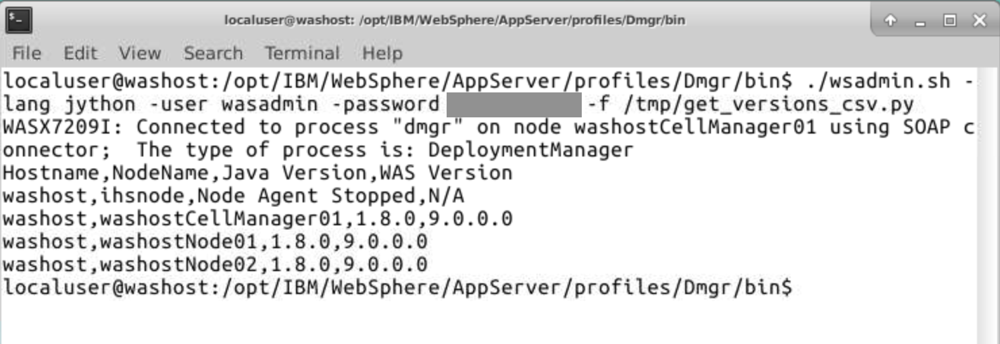

# WebSphere ND configuration

Get all WebSphere online nodes from Deployment Manager with wsadmin and [Jython script](get_versions_csv.py) in CSV format


## Usage
- Run *wsadmin* CLI with [Jython script](get_versions_csv.py)

```bash
./wsadmin.sh -lang jython -f /path/to/script/check_versions_csv.py -user <username> -password <password>
```

Sample output



Remarks:
*Script get version from online node via Mbeans*